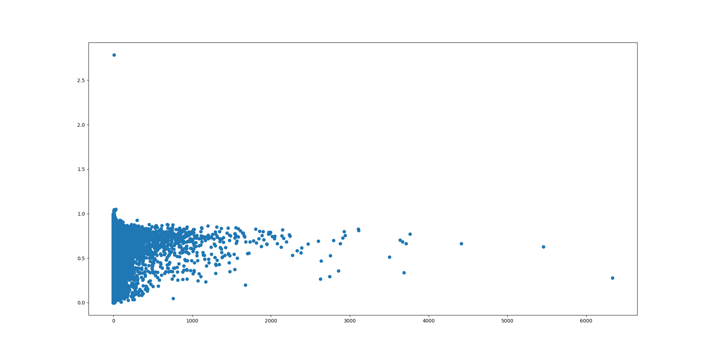
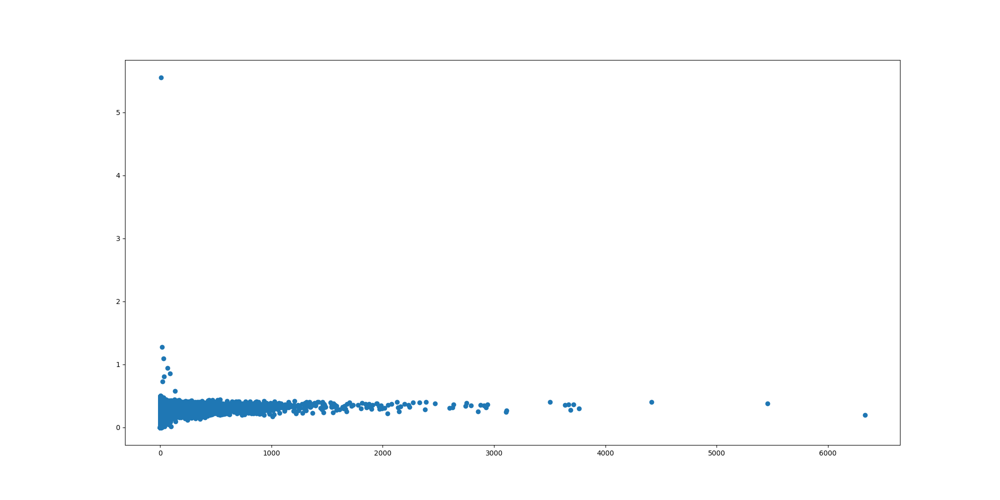

# Violet Styler

Ultra-Personalized Custom Service Implementation for `Violet-Server`

## What is Violet Styler?

`Violet Styler` is a data analyzer to provide users with personalized data.

## Features

### Burst Time

```
1946094
 0.8, 0.5, 0.9, 0.8, 1.7, 2.8, 1.9, 1.2, 1.3, 0.9, 0.7, 0.5, 1.3, 1.2, 1.1, 0.7, 0.9, 0.9, 0.8, 0.8, 0.9, 1.1, 1.5, 1.7, 1.2, 0.8, 1.3, 1.0, 0.8, 1.2, 1.3, 0.9, 0.5, 0.7, 0.9, 0.5, 0.9, 1.8, 0.1, 0.0, 0.0
1948960
 0.9, 1.2, 1.6, 1.9, 1.8, 1.6, 1.5, 2.0, 1.8, 1.4, 1.3, 1.4, 1.6, 1.4, 1.7, 1.5, 0.5, 0.6, 1.1, 0.7, 1.2, 1.0, 1.1, 0.7, 0.7, 0.7, 0.6, 0.7, 0.8, 1.2, 1.0, 0.4, 0.3, 0.5, 0.3, 1.0, 1.5, 2.4, 1.5, 1.1, 1.3, 0.8, 1.1, 1.2, 0.7, 0.9, 0.7, 0.8, 0.6, 0.8, 0.6, 0.7, 0.5, 0.5, 0.4, 0.6, 0.4, 0.5, 0.7, 1.2, 0.7, 0.9, 0.9, 0.8, 0.7, 0.8, 0.4, 0.8, 1.3, 2.4, 0.1
1947825
 2.3, 1.2, 1.4, 1.2, 0.8, 1.7, 1.9, 0.8, 1.0, 1.1, 1.2, 0.8, 0.6, 0.5, 0.8, 0.8, 0.5, 0.8, 0.5, 0.4, 0.5, 1.3, 1.0, 0.8, 1.8, 0.0
1947008
 1.8, 1.7, 1.5, 1.5, 1.1, 1.1, 0.8, 0.9, 0.7, 0.5, 1.0, 0.5, 1.2, 1.9, 1.1, 1.3, 1.3, 0.9, 0.5, 0.3, 0.2, 0.4, 1.7, 0.0
1946213
 2.2, 1.8, 1.5, 1.2, 1.2, 1.0, 0.7, 0.6, 0.9, 0.9, 1.0, 0.7, 1.0, 0.8, 0.8, 0.5, 0.5, 0.6, 0.4, 1.6, 1.9, 0.0
1945434
 3.4, 2.0, 1.9, 2.4, 2.8, 1.7, 1.2, 0.9, 0.8, 1.1, 1.6, 1.8, 1.7, 1.4, 1.2, 1.1, 1.7, 2.2, 1.0, 0.6, 1.0, 1.3, 1.1, 0.8, 0.7, 0.7, 1.2, 1.1, 0.7, 0.6, 1.1, 2.1, 1.7, 1.0, 0.9, 0.5, 0.6, 0.7, 0.6, 0.5, 0.5, 0.5, 0.4, 0.3, 0.4, 0.4, 0.4, 0.6, 0.7, 0.6, 0.7, 0.6, 0.6, 0.6, 0.4, 0.3, 0.2, 0.1, 0.7, 0.0, 0.0
1942740
 4.9, 3.9, 3.0, 1.9, 1.5, 2.6, 2.9, 1.9, 1.7, 1.3, 1.5, 1.3, 2.1, 1.5, 1.2, 1.7, 2.8, 1.3, 1.2, 1.1, 1.3, 1.2, 1.1, 1.0, 1.4, 1.7, 1.1, 1.8, 2.8, 2.4, 2.3, 2.9, 2.9, 1.1, 1.3, 2.5, 1.6, 1.4, 1.3, 2.7, 1.4, 1.0, 0.9, 1.2, 0.8, 0.7, 0.8, 0.7, 0.5, 0.4, 0.4, 0.3, 0.3, 0.3, 0.2, 0.2, 0.2, 0.1, 0.1, 0.1, 0.1, 0.2, 0.1, 0.1, 0.1, 0.1, 0.1, 0.1, 0.1, 0.1, 0.1, 0.1, 0.1, 0.1, 0.1, 0.1, 0.1, 0.1, 0.1, 0.1, 0.1, 0.1, 0.1, 0.1, 0.1, 0.1, 0.1, 0.1, 0.1, 0.6, 0.0
1945287
 2.0, 1.4, 1.4, 1.2, 1.2, 1.3, 1.0, 1.5, 0.8, 0.8, 1.2, 1.1, 1.0, 1.0, 1.4, 1.9, 1.3, 1.0, 0.7, 0.9, 0.4, 0.5, 0.7, 0.7, 0.9, 1.1, 0.7, 0.6, 0.6, 1.2, 1.1, 1.3, 1.2, 0.5, 0.6, 0.6, 0.6, 0.6, 0.5, 0.4, 0.3, 0.4, 0.5, 0.7, 0.9, 1.3, 1.4, 2.3, 1.6, 2.1, 1.3, 0.0
1944305
 1.9, 1.7, 1.9, 2.3, 3.1, 2.3, 1.7, 1.2, 0.8, 0.9, 1.0, 1.1, 1.0, 0.6, 0.8, 0.8, 0.8, 0.6, 0.6, 0.7, 0.6, 1.1, 0.6, 0.5, 0.4, 0.5, 0.7, 0.4, 0.4, 0.3, 0.7, 1.1, 0.0
1944094
 1.5, 1.1, 1.3, 1.1, 1.2, 1.2, 1.0, 0.6, 0.6, 1.5, 0.0
1948755
 2.3, 1.6, 1.5, 1.6, 1.4, 1.1, 1.2, 1.6, 1.6, 1.1, 1.1, 1.5, 1.3, 1.2, 1.6, 1.7, 1.0, 0.8, 0.8, 1.0, 0.9, 0.9, 0.5, 0.6, 0.6, 0.4, 0.4, 0.6, 1.2, 0.6, 0.4, 0.4, 0.3, 0.3, 0.4, 0.7, 1.2, 1.5, 0.0
1944288
 3.2, 1.3, 1.3, 2.4, 3.9, 3.7, 3.7, 3.4, 3.5, 3.7, 1.9, 2.0, 2.8, 2.3, 1.0, 2.0, 1.7, 1.1, 2.0, 1.8, 1.4, 1.7, 1.1, 2.1, 1.5, 1.5, 2.0, 1.4, 1.2, 1.3, 0.8, 0.9, 2.4, 3.0, 1.7, 1.3, 1.5, 1.4, 1.2, 1.1, 1.1, 0.9, 1.4, 1.2, 1.1, 0.9, 0.8, 0.9, 1.2, 0.7, 0.7, 0.6, 0.5, 0.5, 2.5, 2.5, 1.6, 1.5, 1.1, 1.1, 1.0, 0.9, 0.6, 0.9, 0.6, 0.8, 0.9, 0.6, 0.6, 0.8, 1.0, 0.8, 0.8, 0.8, 0.8, 0.6, 0.9, 1.7, 2.4, 1.1, 0.8, 0.7, 1.8, 1.1, 1.8, 1.7, 1.3, 0.9, 0.7, 0.6, 0.8, 0.5, 0.9, 0.6, 0.5, 0.6, 0.6, 0.4, 1.2, 0.5, 1.8, 1.6, 0.4, 0.3, 0.3, 0.7, 1.0, 1.0, 0.4, 0.3, 0.7, 1.1, 1.0, 0.7, 0.7, 0.6, 0.5, 0.6, 0.8, 0.6, 0.4, 0.5, 0.5, 0.4, 0.9, 0.9, 0.7, 0.5, 0.5, 0.6, 0.6, 0.6, 1.0, 0.6, 0.6, 0.4, 0.6, 0.4, 0.4, 0.3, 0.2, 0.2, 0.2, 0.3, 0.2, 0.2, 0.3, 0.2, 0.1, 0.2, 0.4, 0.4, 0.6, 0.6, 0.6, 0.7, 0.5, 0.5, 0.9, 0.6, 0.3, 0.5, 0.8, 0.5, 0.5, 0.5, 0.4, 0.4, 0.2, 0.2, 0.3, 0.4, 0.3, 0.3, 0.7, 0.4, 0.9, 0.6, 0.1, 0.2, 0.3, 0.0
1945580
 1.5, 1.2, 2.2, 1.7, 1.2, 0.8, 1.0, 0.9, 0.9, 0.7, 2.0, 1.6, 1.1, 1.0, 0.8, 1.0, 1.1, 0.7, 0.5, 0.7, 0.9, 0.8, 0.5, 0.9, 0.6, 0.5, 2.1, 1.8, 1.2, 0.3, 0.8, 0.0, 0.0
1949296
 1.0, 1.2, 1.4, 1.9, 1.8, 1.6, 1.4, 1.6, 1.7, 1.3, 1.3, 1.4, 1.6, 1.3, 1.6, 1.6, 0.5, 0.6, 1.1, 0.7, 1.2, 1.0, 0.9, 0.7, 0.7, 0.7, 0.7, 0.7, 0.8, 1.0, 0.9, 0.4, 0.3, 0.5, 0.3, 0.9, 1.5, 2.3, 1.6, 1.1, 1.3, 0.8, 1.1, 1.3, 0.8, 0.9, 0.8, 0.9, 0.7, 0.8, 0.6, 0.8, 0.6, 0.5, 0.5, 0.7, 0.4, 0.6, 0.7, 1.2, 0.7, 0.9, 0.9, 0.8, 0.8, 0.8, 0.5, 0.8, 1.4, 2.6, 0.1
1947082
 1.5, 0.7, 1.8, 1.5, 1.1, 1.0, 1.3, 1.5, 1.5, 0.9, 0.9, 1.0, 1.0, 0.6, 0.6, 1.0, 1.8, 0.9, 1.0, 0.8, 1.0, 1.8, 1.0, 0.5, 0.8, 0.6, 0.2, 0.6, 0.0
1948736
 1.0, 1.6, 1.6, 1.0, 1.2, 0.9, 1.1, 0.8, 1.1, 0.8, 1.4, 1.7, 1.3, 1.7, 1.5, 1.4, 1.0, 0.6, 1.4, 1.4, 1.4, 1.1, 1.5, 0.9, 0.7, 0.9, 1.3, 0.9, 1.7, 1.0, 0.7, 1.3, 1.5, 1.5, 0.7, 0.2, 0.2, 0.2, 0.2, 0.1, 0.1, 0.2, 0.0
1945918
 3.2, 2.7, 2.4, 1.7, 1.3, 1.0, 0.8, 0.9, 1.0, 0.9, 0.8, 0.7, 1.1, 0.5, 0.6, 0.8, 0.7, 0.6, 0.4, 0.5, 1.0, 1.2, 0.7, 0.2, 0.3, 0.0
1947215
 1.3, 2.1, 1.3, 0.9, 0.4, 0.6, 1.3, 0.0
1948470
 1.9, 0.8, 1.3, 0.1
1947684
 2.3, 2.0, 1.2, 1.6, 1.8, 1.1, 1.5, 1.2, 0.9, 1.0, 1.4, 1.0, 0.7, 0.8, 0.7, 1.1, 0.6, 0.3, 0.5, 0.4, 0.3, 1.3, 0.8, 0.6, 0.0
```

## Personal Read Pattern Analysis

### Thumbnail Aggro Index (TAI)

### Valid Read Time per Pages (VRTP)

```
VRTP = VRT / VRP
VRT := Valid Read Time
VRP := Valid Read Page
```

### MPP & V(MPP), V(MPP)'s Singularity

```
MPP = P x VT ( Page x Valid Time )
V(MPP) = VT x COUNT(P)
```

### Reproduced Valid Read-Time per Pages (RVRTP)

### VRP with Concentration Weight (FVRP)

### Noise Filter Model (NFM)

### User Article Score (Score)

```
Score := nfm(vavg(mpp) / pages) * fvrp
```

```
...
----------------------------
1154251, 46, 63500ms, 1380.4ms, 1522.0, 46/49
50700ms, 1152.3ms, 1071.2, 44/49, 1349.9796571805266
----------------------------
1221893, 40, 59800ms, 1533.3ms, 1342.9, 39/64
45000ms, 1250.0ms, 951.2, 36/64, 1351.889235878271
----------------------------
1809473, 47, 56300ms, 1759.4ms, 1417.7, 32/71
40500ms, 1396.6ms, 885.7, 29/71, 1351.9940779711249
----------------------------
1906183, 185, 264800ms, 1463.0ms, 1750.6, 181/262
204100ms, 1179.8ms, 1050.8, 173/262, 1352.9949475513167
----------------------------
1613612, 27, 33900ms, 1412.5ms, 1573.0, 24/29
22300ms, 1013.6ms, 870.4, 22/29, 1357.5651516140024
----------------------------
1933860, 58, 76700ms, 1475.0ms, 1763.1, 52/76
53400ms, 1089.8ms, 728.2, 49/76, 1359.1061930239641
----------------------------
1962319, 25, 34700ms, 1388.0ms, 1512.7, 25/26
23100ms, 1004.3ms, 795.9, 23/26, 1359.2911665467584
----------------------------
1898387, 32, 44900ms, 1403.1ms, 1024.8, 32/33
39500ms, 1274.2ms, 743.1, 31/33, 1365.4113343788645
----------------------------
1960738, 87, 151100ms, 1820.5ms, 1702.1, 83/186
121100ms, 1552.6ms, 1369.4, 78/186, 1366.7125769557317
----------------------------
1872642, 86, 121500ms, 1396.6ms, 1311.4, 87/87
103900ms, 1236.9ms, 946.4, 84/87, 1368.3342974231996
----------------------------
1339881, 59, 82700ms, 1401.7ms, 1922.6, 59/60
59400ms, 1060.7ms, 1028.1, 56/60, 1376.3851899085778
----------------------------
1806895, 34, 48600ms, 1429.4ms, 1035.1, 34/35
43800ms, 1327.3ms, 865.6, 33/35, 1378.6342730209055
----------------------------
1867350, 76, 106700ms, 1403.9ms, 1801.0, 76/77
65100ms, 930.0ms, 632.5, 70/77, 1379.009154965741
----------------------------
1420802, 41, 58400ms, 1424.4ms, 1208.9, 41/42
49000ms, 1256.4ms, 961.8, 39/42, 1382.880040586834
----------------------------
1015698, 54, 67600ms, 1778.9ms, 1107.2, 38/78
62100ms, 1678.4ms, 935.2, 37/78, 1385.3554930955281
----------------------------
1024612, 25, 35500ms, 1420.0ms, 1478.6, 25/26
24800ms, 1078.3ms, 956.4, 23/26, 1390.3790728883907
----------------------------
953886, 61, 143200ms, 2347.5ms, 1763.1, 61/203
129200ms, 2189.8ms, 1566.5, 59/203, 1392.1872473865333
----------------------------
1890089, 200, 225800ms, 1505.3ms, 1403.6, 150/207
178300ms, 1255.6ms, 899.4, 142/207, 1397.7306540018603
----------------------------
1743769, 28, 40100ms, 1432.1ms, 1915.4, 28/30
30500ms, 1129.6ms, 1114.5, 27/30, 1399.2958533066783
----------------------------
1940767, 92, 99300ms, 1576.2ms, 1179.1, 63/93
88200ms, 1445.9ms, 944.1, 61/93, 1401.395673322073
----------------------------
1151371, 25, 34700ms, 1445.8ms, 1450.3, 24/26
28400ms, 1234.8ms, 1061.0, 23/26, 1406.0870647428815
----------------------------
1888129, 195, 226600ms, 1481.0ms, 1632.6, 153/198
162900ms, 1139.2ms, 997.0, 143/198, 1406.8333087969354
----------------------------
1255350, 25, 36100ms, 1444.0ms, 1681.9, 25/26
24300ms, 1056.5ms, 1068.9, 23/26, 1415.767761153954
----------------------------
1727309, 145, 210000ms, 1448.3ms, 1236.4, 145/147
175300ms, 1261.2ms, 806.0, 139/147, 1417.7861096014856
----------------------------
666794, 32, 46700ms, 1459.4ms, 1428.0, 32/33
40000ms, 1290.3ms, 1091.1, 31/33, 1426.1872387509272
----------------------------
1960738, 160, 230300ms, 1485.8ms, 1578.0, 155/186
175100ms, 1199.3ms, 1056.4, 146/186, 1427.3137991123783
----------------------------
979208, 27, 40500ms, 1500.0ms, 931.7, 27/29
33300ms, 1332.0ms, 746.0, 25/29, 1431.4550291401042
----------------------------
1515227, 154, 227600ms, 1468.4ms, 1384.0, 155/156
177000ms, 1220.7ms, 1027.1, 145/156, 1433.7040097229467
----------------------------
1898388, 35, 78500ms, 2242.9ms, 1525.6, 35/100
71900ms, 2114.7ms, 1349.5, 34/100, 1433.9550608455825
----------------------------
1882677, 39, 107700ms, 2834.2ms, 1756.1, 38/166
94500ms, 2625.0ms, 1556.6, 36/166, 1435.1146484490482
----------------------------
1947082, 28, 41700ms, 1489.3ms, 1147.2, 28/29
37100ms, 1374.1ms, 996.5, 27/29, 1443.5091908675424
----------------------------
1007494, 41, 67800ms, 1695.0ms, 1647.6, 40/72
50700ms, 1370.3ms, 1235.5, 37/72, 1445.1967722417817
----------------------------
1499344, 26, 38800ms, 1492.3ms, 1096.5, 26/27
33700ms, 1348.0ms, 842.0, 25/27, 1445.5672825026238
----------------------------
1869667, 202, 298000ms, 1475.2ms, 1351.6, 202/203
244400ms, 1266.3ms, 848.7, 193/203, 1447.990714430915
----------------------------
1735191, 191, 277300ms, 1482.9ms, 1555.4, 187/193
219200ms, 1231.5ms, 1056.6, 178/193, 1451.6838696359766
----------------------------
1592382, 27, 40700ms, 1507.4ms, 1132.3, 27/28
36200ms, 1392.3ms, 986.8, 26/28, 1454.5416341701834
----------------------------
1739086, 89, 130600ms, 1484.1ms, 1774.6, 88/91
96100ms, 1157.8ms, 1189.6, 83/91, 1455.618372875887
----------------------------
1226900, 205, 275300ms, 1504.4ms, 1923.9, 183/208
187700ms, 1091.3ms, 942.2, 172/208, 1458.7868705074773
----------------------------
1940730, 29, 45400ms, 1513.3ms, 1279.0, 30/32
39200ms, 1351.7ms, 953.3, 29/32, 1461.8846163495537
----------------------------
1800818, 46, 71700ms, 1493.8ms, 1810.7, 48/49
54700ms, 1189.1ms, 831.5, 46/49, 1465.2692649667297
----------------------------
1956309, 54, 54800ms, 1660.6ms, 1608.1, 33/55
45200ms, 1412.5ms, 797.2, 32/55, 1466.9873361530817
----------------------------
596012, 36, 52300ms, 1538.2ms, 1292.7, 34/38
41900ms, 1309.4ms, 935.5, 32/38, 1467.5445532978995
----------------------------
1743076, 29, 44100ms, 1520.7ms, 920.8, 29/31
36000ms, 1333.3ms, 608.6, 27/31, 1478.988492236055
----------------------------
1746559, 515, 767500ms, 1507.9ms, 1929.8, 509/517
536600ms, 1124.9ms, 1115.0, 477/517, 1480.9489039599057
----------------------------
563120, 72, 102000ms, 1522.4ms, 1812.9, 67/74
77500ms, 1210.9ms, 1024.1, 64/74, 1481.6535760191393
----------------------------
1904754, 40, 60500ms, 1512.5ms, 1074.5, 40/41
46500ms, 1256.8ms, 606.1, 37/41, 1484.8662430350014
----------------------------
1962154, 39, 60300ms, 1546.2ms, 1084.4, 39/42
51700ms, 1397.3ms, 893.7, 37/42, 1484.9119242824602
----------------------------
1960820, 54, 82200ms, 1522.2ms, 1456.7, 54/55
67900ms, 1305.8ms, 946.7, 52/55, 1490.7026393282026
----------------------------
1921092, 26, 39800ms, 1530.8ms, 1402.7, 26/26
25900ms, 1126.1ms, 894.0, 23/26, 1500.9039549081674
----------------------------
1960070, 35, 53700ms, 1534.3ms, 1394.9, 35/36
45700ms, 1344.1ms, 858.6, 34/36, 1501.1908317209559
----------------------------
1788753, 25, 38400ms, 1536.0ms, 1771.1, 25/26
21600ms, 981.8ms, 980.1, 22/26, 1506.7186652125376
----------------------------
1815636, 26, 42800ms, 1646.2ms, 1573.9, 26/38
35300ms, 1412.0ms, 1072.7, 25/38, 1507.202468178827
----------------------------
1850224, 55, 86100ms, 1537.5ms, 1571.7, 56/57
65400ms, 1234.0ms, 900.3, 53/57, 1507.280299187676
----------------------------
1700657, 48, 86700ms, 1635.8ms, 1887.7, 53/78
55200ms, 1150.0ms, 1164.6, 48/78, 1509.6524680611108
----------------------------
1594717, 32, 49300ms, 1540.6ms, 1843.0, 32/33
38800ms, 1251.6ms, 912.9, 31/33, 1510.2354393352045
----------------------------
1961309, 25, 40400ms, 1553.8ms, 1553.2, 26/27
33700ms, 1348.0ms, 1186.3, 25/27, 1514.1096029842151
----------------------------
1743076, 30, 46800ms, 1560.0ms, 1320.3, 30/31
40200ms, 1386.2ms, 947.1, 29/31, 1516.2603034255042
----------------------------
1886261, 64, 102300ms, 1650.0ms, 1352.7, 62/83
85300ms, 1445.8ms, 982.8, 59/83, 1517.9759073745715
----------------------------
1743769, 29, 45300ms, 1562.1ms, 1206.7, 29/30
36600ms, 1355.6ms, 971.6, 27/30, 1521.649657070123
----------------------------
1315675, 26, 40800ms, 1569.2ms, 1192.2, 26/27
32400ms, 1350.0ms, 956.1, 24/27, 1523.4135538207113
----------------------------
1958040, 35, 54700ms, 1562.9ms, 1133.9, 35/36
48600ms, 1429.4ms, 836.8, 34/36, 1526.7778274844925
----------------------------
1699041, 25, 39200ms, 1568.0ms, 1508.3, 25/26
31200ms, 1300.0ms, 757.7, 24/26, 1531.0438564587632
----------------------------
1958040, 35, 55100ms, 1574.3ms, 1294.7, 35/36
41700ms, 1303.1ms, 986.9, 32/36, 1533.8396647170057
----------------------------
797321, 41, 66300ms, 1578.6ms, 932.1, 42/44
61600ms, 1502.4ms, 804.1, 41/44, 1534.1456964786832
----------------------------
1958040, 35, 55100ms, 1574.3ms, 1114.2, 35/36
42900ms, 1340.6ms, 848.8, 32/36, 1534.4848024601288
----------------------------
1743769, 29, 45400ms, 1565.5ms, 1826.5, 29/30
31600ms, 1170.4ms, 1143.4, 27/30, 1535.1959808625045
----------------------------
1208851, 25, 43500ms, 1611.1ms, 1196.7, 27/30
35300ms, 1412.0ms, 1005.3, 25/30, 1542.43161234016
----------------------------
1929474, 32, 50500ms, 1578.1ms, 1465.2, 32/33
38500ms, 1283.3ms, 896.3, 30/33, 1542.9711151064782
----------------------------
1949296, 70, 110100ms, 1572.9ms, 1892.5, 70/71
91100ms, 1339.7ms, 1310.7, 68/71, 1545.1487125647607
----------------------------
1935996, 55, 82900ms, 1594.2ms, 1907.0, 52/57
56600ms, 1179.2ms, 1281.3, 48/57, 1554.9216487327826
----------------------------
1881026, 61, 97800ms, 1603.3ms, 1390.6, 61/62
81300ms, 1401.7ms, 1087.5, 58/62, 1558.9393345898548
----------------------------
1675017, 53, 79100ms, 1647.9ms, 1291.3, 48/54
69200ms, 1504.3ms, 1113.5, 46/54, 1561.238708651271
----------------------------
1815096, 31, 49600ms, 1600.0ms, 1305.6, 31/32
40900ms, 1410.3ms, 1124.4, 29/32, 1563.6935641646676
----------------------------
1961774, 33, 53000ms, 1606.1ms, 1449.5, 33/34
42700ms, 1377.4ms, 1171.6, 31/34, 1565.4306490378517
----------------------------
1962154, 39, 59700ms, 1613.5ms, 1890.3, 37/42
40200ms, 1182.4ms, 1245.3, 34/42, 1566.2319400111487
----------------------------
1961774, 33, 52900ms, 1603.0ms, 1634.6, 33/34
45300ms, 1415.6ms, 1263.5, 32/34, 1571.2122667447345
----------------------------
1933356, 27, 43700ms, 1618.5ms, 975.3, 27/28
35500ms, 1420.0ms, 694.6, 25/28, 1571.5550526598536
----------------------------
1101013, 25, 40400ms, 1616.0ms, 1300.7, 25/26
30800ms, 1339.1ms, 934.2, 23/26, 1573.3583982865903
----------------------------
1581036, 28, 45200ms, 1614.3ms, 1697.6, 28/30
37900ms, 1403.7ms, 1321.8, 27/30, 1573.780598243401
----------------------------
1962154, 41, 65800ms, 1604.9ms, 1921.0, 41/42
40700ms, 1100.0ms, 1209.0, 37/42, 1576.0970885483462
----------------------------
1902426, 33, 58900ms, 1784.8ms, 1788.2, 33/54
34900ms, 1203.4ms, 884.9, 29/54, 1583.3553971896697
----------------------------
1961309, 26, 42600ms, 1638.5ms, 1149.3, 26/27
37900ms, 1516.0ms, 991.8, 25/27, 1597.0186156159775
----------------------------
1588986, 56, 102300ms, 1894.4ms, 1731.3, 54/99
81700ms, 1602.0ms, 1267.2, 51/99, 1597.7168354709559
----------------------------
1221289, 49, 79200ms, 1650.0ms, 1761.0, 48/53
60400ms, 1342.2ms, 1332.7, 45/53, 1602.0992165631021
----------------------------
1960820, 47, 78900ms, 1678.7ms, 1243.2, 47/55
64800ms, 1472.7ms, 992.3, 44/55, 1603.8605936270249
----------------------------
1962384, 54, 88800ms, 1644.4ms, 1938.0, 54/55
69300ms, 1332.7ms, 762.5, 52/55, 1613.3300979679323
----------------------------
1896551, 42, 69400ms, 1652.4ms, 1449.2, 42/43
59200ms, 1480.0ms, 1256.6, 40/43, 1616.5281592042518
----------------------------
534639, 32, 53600ms, 1675.0ms, 1408.0, 32/34
48000ms, 1548.4ms, 1238.3, 31/34, 1620.027949877586
----------------------------
1951603, 41, 67700ms, 1651.2ms, 1807.3, 41/42
46600ms, 1226.3ms, 902.0, 38/42, 1620.0515746591097
----------------------------
1953014, 33, 57500ms, 1691.2ms, 1400.5, 34/37
47500ms, 1484.4ms, 1160.6, 32/37, 1634.6480554227876
----------------------------
1338977, 26, 60200ms, 1672.2ms, 1635.5, 36/38
46500ms, 1367.6ms, 980.3, 34/38, 1636.581484692087
----------------------------
1466326, 25, 42200ms, 1688.0ms, 1146.2, 25/26
37500ms, 1562.5ms, 987.3, 24/26, 1639.446336782417
----------------------------
1961123, 34, 55600ms, 1684.8ms, 1729.6, 33/35
39100ms, 1303.3ms, 1298.8, 30/35, 1644.61645171296
----------------------------
1908233, 36, 59000ms, 1685.7ms, 1737.5, 35/37
53700ms, 1579.4ms, 1646.9, 34/37, 1646.789346308596
----------------------------
1919157, 43, 72500ms, 1686.0ms, 1655.5, 43/44
58800ms, 1434.1ms, 1206.8, 41/44, 1649.6142321886164
----------------------------
1772464, 38, 62600ms, 1691.9ms, 1651.4, 37/40
45200ms, 1329.4ms, 1157.5, 34/40, 1650.5366633241208
----------------------------
1653409, 27, 46400ms, 1718.5ms, 1064.2, 27/28
37900ms, 1516.0ms, 817.2, 25/28, 1655.511824796773
----------------------------
1939398, 41, 67700ms, 1692.5ms, 1862.0, 40/42
41200ms, 1144.4ms, 841.4, 36/42, 1657.89547826345
----------------------------
1962502, 43, 67300ms, 1725.6ms, 1451.0, 39/44
47100ms, 1345.7ms, 956.6, 35/44, 1659.9975110195644
----------------------------
1856765, 25, 25300ms, 2530.0ms, 1371.2, 10/26
25300ms, 2530.0ms, 1371.2, 10/26, 1662.1846087632443
----------------------------
1962154, 41, 69600ms, 1697.6ms, 1940.1, 41/42
52000ms, 1333.3ms, 1110.4, 39/42, 1665.8221246669254
----------------------------
1956978, 120, 202400ms, 1700.8ms, 1795.9, 119/121
155800ms, 1391.1ms, 1305.2, 112/121, 1670.4049199734177
----------------------------
951829, 94, 152200ms, 1710.1ms, 1964.2, 89/95
108800ms, 1310.8ms, 1264.0, 83/95, 1672.2424662359297
----------------------------
1358932, 29, 49600ms, 1710.3ms, 1274.5, 29/30
39200ms, 1451.9ms, 846.1, 27/30, 1673.7744251820948
----------------------------
1961774, 33, 56700ms, 1718.2ms, 1037.6, 33/34
44500ms, 1483.3ms, 759.0, 30/34, 1674.637849923029
----------------------------
1961774, 33, 56900ms, 1724.2ms, 1253.6, 33/34
51400ms, 1606.3ms, 1077.6, 32/34, 1676.7482692123276
----------------------------
1252103, 25, 42900ms, 1716.0ms, 1724.8, 25/26
31000ms, 1347.8ms, 1230.0, 23/26, 1677.87477981807
----------------------------
1462108, 29, 49900ms, 1720.7ms, 1384.2, 29/31
43600ms, 1557.1ms, 1099.5, 28/31, 1678.1283198890626
----------------------------
1549483, 31, 54000ms, 1741.9ms, 1730.9, 31/36
45900ms, 1530.0ms, 1305.2, 30/36, 1678.223488411303
----------------------------
1940832, 49, 96700ms, 1934.0ms, 1760.6, 50/88
80300ms, 1672.9ms, 1178.9, 48/88, 1678.2564208245904
----------------------------
1248324, 153, 255400ms, 1714.1ms, 1759.2, 149/154
191800ms, 1370.0ms, 1074.9, 140/154, 1678.4857827054848
----------------------------
927823, 28, 48900ms, 1746.4ms, 840.3, 28/30
44700ms, 1655.6ms, 707.8, 27/30, 1680.1562724881542
----------------------------
1902216, 115, 199700ms, 1721.6ms, 1716.8, 116/117
166000ms, 1482.1ms, 1144.1, 112/117, 1690.917041142934
----------------------------
1741547, 35, 60500ms, 1728.6ms, 1777.6, 35/36
51600ms, 1517.6ms, 1302.1, 34/36, 1692.7165398409668
----------------------------
886191, 28, 48700ms, 1739.3ms, 1393.7, 28/29
37700ms, 1450.0ms, 926.2, 26/29, 1693.0364938674165
----------------------------
946168, 25, 44600ms, 1784.0ms, 1285.8, 25/27
44600ms, 1784.0ms, 1285.8, 25/27, 1700.171615794502
----------------------------
1633894, 38, 66400ms, 1794.6ms, 1814.1, 37/47
42400ms, 1284.8ms, 1134.1, 33/47, 1703.5569967846227
----------------------------
1926734, 27, 43700ms, 1820.8ms, 893.5, 24/28
40100ms, 1743.5ms, 830.3, 23/28, 1703.8396357766899
----------------------------
1743769, 29, 50700ms, 1748.3ms, 1158.4, 29/30
41700ms, 1544.4ms, 914.2, 27/30, 1706.7976866437946
----------------------------
1069268, 33, 58100ms, 1760.6ms, 1316.3, 33/34
48900ms, 1577.4ms, 1136.1, 31/34, 1706.9307767145528
----------------------------
1945287, 51, 78000ms, 1814.0ms, 1409.5, 43/52
57800ms, 1482.1ms, 996.4, 39/52, 1708.9864516772518
----------------------------
1415761, 34, 59800ms, 1758.8ms, 1101.1, 34/36
50700ms, 1584.4ms, 870.7, 32/36, 1711.5140097331978
----------------------------
1961774, 33, 58200ms, 1763.6ms, 1441.3, 33/34
50400ms, 1575.0ms, 983.9, 32/34, 1718.4393650481259
----------------------------
1397056, 25, 40800ms, 1773.9ms, 1592.2, 23/26
33300ms, 1513.6ms, 1045.0, 22/26, 1720.1670868173699
----------------------------
1885845, 27, 47600ms, 1763.0ms, 1115.3, 27/28
41900ms, 1611.5ms, 820.1, 26/28, 1721.8872347045378
----------------------------
1959944, 213, 374600ms, 1767.0ms, 1461.5, 212/215
301500ms, 1507.5ms, 999.7, 200/215, 1724.022639815329
----------------------------
1962194, 25, 36200ms, 1905.3ms, 1251.3, 19/26
31000ms, 1722.2ms, 1008.1, 18/26, 1725.3988657078942
----------------------------
1444651, 102, 180200ms, 1766.7ms, 1694.9, 102/104
143700ms, 1481.4ms, 1098.2, 97/104, 1731.2327483793297
----------------------------
1164496, 26, 46200ms, 1776.9ms, 1763.6, 26/28
31300ms, 1304.2ms, 610.0, 24/28, 1734.612059071714
----------------------------
1811399, 34, 64600ms, 1794.4ms, 1599.3, 36/38
47600ms, 1442.4ms, 1141.2, 33/38, 1744.892811233776
----------------------------
1655175, 35, 57400ms, 1851.6ms, 1070.4, 31/38
48700ms, 1679.3ms, 873.5, 29/38, 1746.4215987069265
----------------------------
1162663, 29, 52500ms, 1810.3ms, 1681.0, 29/31
45300ms, 1617.9ms, 1360.9, 28/31, 1747.958770117538
----------------------------
1962154, 40, 72400ms, 1810.0ms, 1541.2, 40/42
61300ms, 1613.2ms, 1313.5, 38/42, 1748.2218813900338
----------------------------
1961123, 34, 60600ms, 1782.4ms, 1894.2, 34/35
39100ms, 1261.3ms, 911.5, 31/35, 1748.612124312909
----------------------------
960134, 28, 50200ms, 1792.9ms, 1078.7, 28/30
40500ms, 1557.7ms, 659.9, 26/30, 1749.4110477855743
----------------------------
1961309, 26, 46700ms, 1796.2ms, 1705.5, 26/27
33600ms, 1400.0ms, 1053.2, 24/27, 1751.8646347744339
----------------------------
1960820, 54, 96600ms, 1788.9ms, 1324.2, 54/55
74400ms, 1488.0ms, 802.2, 50/55, 1752.1959358057757
----------------------------
1955071, 32, 57800ms, 1806.3ms, 1777.5, 32/35
37900ms, 1306.9ms, 906.7, 29/35, 1754.6660965328497
----------------------------
1888129, 30, 127900ms, 4263.3ms, 1433.5, 30/198
126100ms, 4670.4ms, 779.8, 27/198, 1754.689883119958
----------------------------
1223958, 28, 49500ms, 1833.3ms, 1891.3, 27/33
36500ms, 1460.0ms, 1397.4, 25/33, 1759.6015252515663
----------------------------
1470418, 32, 57800ms, 1806.3ms, 1900.5, 32/33
43600ms, 1453.3ms, 1339.1, 30/33, 1771.1867687473784
----------------------------
1961309, 25, 38400ms, 1920.0ms, 1890.4, 20/27
32600ms, 1715.8ms, 1711.0, 19/27, 1772.3398951989846
----------------------------
1960820, 54, 96300ms, 1817.0ms, 1520.9, 53/55
82100ms, 1609.8ms, 1067.4, 51/55, 1773.1688200088527
----------------------------
1951643, 42, 46700ms, 2594.4ms, 1553.3, 18/45
39500ms, 2323.5ms, 1110.7, 17/45, 1785.4562188725818
----------------------------
1430576, 40, 73500ms, 1837.5ms, 1438.9, 40/41
56000ms, 1513.5ms, 885.7, 37/41, 1794.016690664721
----------------------------
1903158, 25, 46100ms, 1844.0ms, 1386.8, 25/27
34900ms, 1517.4ms, 845.3, 23/27, 1798.112804000299
----------------------------
1551868, 48, 94200ms, 1847.1ms, 1670.8, 51/54
78300ms, 1598.0ms, 1007.2, 49/54, 1801.965388162729
----------------------------
1531954, 158, 419700ms, 1840.8ms, 1939.2, 228/231
340500ms, 1561.9ms, 1373.2, 218/231, 1805.5705312556197
----------------------------
1946597, 25, 46100ms, 1844.0ms, 1468.6, 25/26
38800ms, 1616.7ms, 977.1, 24/26, 1807.3592068722692
----------------------------
1924502, 33, 59400ms, 1856.3ms, 1989.5, 32/34
39500ms, 1362.1ms, 1312.6, 29/34, 1813.6274990718605
----------------------------
624202, 34, 63000ms, 1852.9ms, 1683.7, 34/35
54700ms, 1657.6ms, 1274.0, 33/35, 1814.122136278998
----------------------------
1939701, 28, 52700ms, 1882.1ms, 1227.1, 28/29
52700ms, 1882.1ms, 1227.1, 28/29, 1818.649547014681
----------------------------
1496985, 26, 48300ms, 1857.7ms, 1975.8, 26/27
34600ms, 1441.7ms, 1394.3, 24/27, 1818.6546750338955
----------------------------
1962465, 89, 166100ms, 1866.3ms, 1892.1, 89/91
121400ms, 1480.5ms, 1386.6, 82/91, 1823.9778358069238
----------------------------
1776824, 54, 106000ms, 2038.5ms, 1625.5, 52/82
85000ms, 1734.7ms, 1063.4, 49/82, 1825.105556191303
----------------------------
1443357, 28, 52400ms, 1871.4ms, 1335.2, 28/30
41700ms, 1603.8ms, 935.0, 26/30, 1826.053281585923
----------------------------
826238, 44, 80600ms, 1874.4ms, 1773.5, 43/45
56600ms, 1451.3ms, 1229.1, 39/45, 1826.8361389278455
----------------------------
1960820, 43, 84200ms, 1958.1ms, 1772.4, 43/55
66500ms, 1662.5ms, 1456.3, 40/55, 1826.8825040863906
----------------------------
1962154, 41, 77000ms, 1878.0ms, 1543.1, 41/42
55300ms, 1494.6ms, 1053.9, 37/42, 1827.2264402224444
----------------------------
1294472, 25, 48100ms, 1924.0ms, 1797.4, 25/30
42100ms, 1754.2ms, 1626.1, 24/30, 1829.6388632103951
----------------------------
730657, 35, 64800ms, 1905.9ms, 1455.0, 34/36
54400ms, 1700.0ms, 1232.4, 32/36, 1829.9627534343228
----------------------------
1439216, 56, 106200ms, 1896.4ms, 1286.0, 56/57
92300ms, 1741.5ms, 1139.6, 53/57, 1832.9466969971231
----------------------------
1961774, 32, 62200ms, 1884.8ms, 1792.8, 33/34
52600ms, 1643.8ms, 1181.6, 32/34, 1843.8286700264705
----------------------------
1960820, 51, 94000ms, 1918.4ms, 1593.6, 49/55
70300ms, 1562.2ms, 1068.4, 45/55, 1850.857204488429
----------------------------
1747727, 80, 146600ms, 1928.9ms, 1938.7, 76/89
120700ms, 1653.4ms, 1329.4, 73/89, 1853.66988455296
----------------------------
1957113, 34, 59500ms, 1919.4ms, 1576.5, 31/35
53800ms, 1793.3ms, 1440.8, 30/35, 1854.0146978766184
----------------------------
1960232, 64, 122200ms, 1909.4ms, 1507.5, 64/65
98300ms, 1638.3ms, 1086.1, 60/65, 1856.9694766799241
----------------------------
1893177, 25, 39700ms, 1985.0ms, 1422.8, 20/26
34800ms, 1831.6ms, 1288.4, 19/26, 1858.6014793556449
----------------------------
1961774, 33, 63200ms, 1915.2ms, 1499.5, 33/34
46100ms, 1536.7ms, 940.7, 30/34, 1860.2146017046848
----------------------------
1814433, 41, 77900ms, 1900.0ms, 1882.1, 41/42
56600ms, 1489.5ms, 1171.8, 38/42, 1860.6301029824504
----------------------------
1737327, 28, 56200ms, 1937.9ms, 1482.9, 29/31
43500ms, 1611.1ms, 871.5, 27/31, 1882.1774993324914
----------------------------
1736397, 54, 104700ms, 1938.9ms, 1267.3, 54/55
93700ms, 1801.9ms, 1063.1, 52/55, 1883.463165498873
----------------------------
1962031, 32, 62100ms, 1940.6ms, 1398.4, 32/33
52200ms, 1740.0ms, 1199.1, 30/33, 1885.0211385486764
----------------------------
1962372, 29, 56000ms, 1931.0ms, 1785.0, 29/30
42900ms, 1588.9ms, 1292.8, 27/30, 1885.0551251859217
----------------------------
1464927, 30, 58300ms, 1943.3ms, 1690.9, 30/32
44800ms, 1600.0ms, 1134.2, 28/32, 1888.4068515220204
----------------------------
1960820, 54, 102200ms, 1928.3ms, 1713.1, 53/55
77600ms, 1583.7ms, 1252.8, 49/55, 1888.7195854573313
----------------------------
1661616, 38, 73400ms, 1931.6ms, 1913.5, 38/39
51900ms, 1482.9ms, 1191.3, 35/39, 1890.6822369700167
----------------------------
1961774, 33, 63800ms, 1933.3ms, 1621.0, 33/34
50200ms, 1619.4ms, 1067.2, 31/34, 1893.6052089678167
----------------------------
1936344, 58, 112900ms, 1946.6ms, 1602.0, 58/59
87600ms, 1622.2ms, 1079.6, 54/59, 1903.4676047047344
----------------------------
1833578, 36, 65300ms, 1978.8ms, 1836.1, 33/38
51400ms, 1658.1ms, 1349.3, 31/38, 1906.960058842261
----------------------------
1962447, 38, 75500ms, 1986.8ms, 1957.9, 38/44
60800ms, 1688.9ms, 1533.8, 36/44, 1918.9309744668162
----------------------------
1912167, 25, 49500ms, 1980.0ms, 1623.1, 25/26
43200ms, 1800.0ms, 1390.7, 24/26, 1923.021125724747
----------------------------
1961774, 33, 65500ms, 1984.8ms, 1591.1, 33/34
53600ms, 1729.0ms, 1260.1, 31/34, 1925.2970217603136
----------------------------
1962372, 30, 57400ms, 1979.3ms, 1991.8, 29/30
43100ms, 1596.3ms, 1432.6, 27/30, 1934.3711753942684
----------------------------
1782832, 28, 55500ms, 1982.1ms, 1832.7, 28/29
40300ms, 1550.0ms, 897.5, 26/29, 1938.43904824927
----------------------------
1697371, 34, 66600ms, 2018.2ms, 1314.8, 33/36
60000ms, 1875.0ms, 1051.8, 32/36, 1939.1326307565832
----------------------------
976866, 27, 56200ms, 2007.1ms, 1781.0, 28/30
44800ms, 1723.1ms, 1512.1, 26/30, 1941.2234382732288
----------------------------
1675017, 53, 105700ms, 1994.3ms, 1456.5, 53/54
89600ms, 1792.0ms, 1229.8, 50/54, 1946.4554615092675
----------------------------
1767267, 40, 79900ms, 1997.5ms, 1932.0, 40/41
69400ms, 1779.5ms, 1388.3, 39/41, 1950.5799549291664
----------------------------
1961774, 33, 66100ms, 2003.0ms, 1725.5, 33/34
48000ms, 1600.0ms, 1196.1, 30/34, 1954.76969137307
----------------------------
1961774, 33, 66500ms, 2015.2ms, 1107.3, 33/34
57100ms, 1841.9ms, 891.1, 31/34, 1959.1154685797223
----------------------------
1607716, 32, 64300ms, 2009.4ms, 1538.7, 32/33
45800ms, 1579.3ms, 761.7, 29/33, 1964.458081504105
----------------------------
1954156, 29, 58600ms, 2020.7ms, 1767.6, 29/30
52300ms, 1867.9ms, 1599.6, 28/30, 1968.4155214298087
----------------------------
1630223, 30, 59000ms, 2034.5ms, 1812.1, 29/31
49400ms, 1764.3ms, 1133.0, 28/31, 1977.1502926591322
----------------------------
1743769, 29, 59200ms, 2041.4ms, 1065.0, 29/30
53400ms, 1907.1ms, 807.5, 28/30, 1982.116866226304
----------------------------
1895434, 34, 70000ms, 2058.8ms, 1758.5, 34/35
56900ms, 1778.1ms, 1394.6, 32/35, 2000.0409664880713
----------------------------
1890565, 41, 57100ms, 2379.2ms, 1604.4, 24/42
43300ms, 1968.2ms, 865.2, 22/42, 2000.558216693863
----------------------------
1961202, 29, 59500ms, 2051.7ms, 1993.5, 29/30
45400ms, 1681.5ms, 1509.7, 27/30, 2002.2923438186642
----------------------------
1946598, 25, 54000ms, 2076.9ms, 1175.8, 26/26
48900ms, 1956.0ms, 1028.4, 25/26, 2013.0235721062056
----------------------------
1961882, 26, 54600ms, 2100.0ms, 1639.9, 26/29
49000ms, 1960.0ms, 1512.3, 25/29, 2016.364806722758
----------------------------
1962194, 25, 52200ms, 2088.0ms, 1253.6, 25/26
47500ms, 1979.2ms, 1157.9, 24/26, 2016.7566313987165
----------------------------
1465373, 25, 50600ms, 2108.3ms, 1991.8, 24/28
42200ms, 1834.8ms, 1531.0, 23/28, 2023.1699035983006
----------------------------
469557, 25, 50300ms, 2095.8ms, 1479.2, 24/26
44100ms, 1917.4ms, 1232.4, 23/26, 2032.6383417226134
----------------------------
1959532, 36, 75000ms, 2083.3ms, 1601.6, 36/37
61600ms, 1811.8ms, 1172.2, 34/37, 2034.362248351442
----------------------------
1958973, 27, 56800ms, 2103.7ms, 1897.5, 27/28
50100ms, 1926.9ms, 1701.5, 26/28, 2040.9392874247883
----------------------------
1882447, 26, 54400ms, 2092.3ms, 1612.0, 26/27
37100ms, 1613.0ms, 965.2, 23/27, 2041.7352484031123
----------------------------
1946598, 25, 52100ms, 2084.0ms, 1900.5, 25/26
42400ms, 1766.7ms, 1115.7, 24/26, 2041.7889551393512
----------------------------
1960712, 46, 96200ms, 2091.3ms, 1823.5, 46/47
74800ms, 1739.5ms, 1249.0, 43/47, 2044.8504823356745
----------------------------
1893856, 38, 82800ms, 2178.9ms, 1258.3, 38/43
71900ms, 1997.2ms, 1013.4, 36/43, 2045.8361154933566
----------------------------
1962319, 25, 52200ms, 2088.0ms, 1870.7, 25/26
42800ms, 1783.3ms, 1151.0, 24/26, 2046.1009424597567
----------------------------
879868, 30, 60800ms, 2171.4ms, 1190.4, 28/36
53800ms, 1992.6ms, 757.6, 27/36, 2047.2230745213228
----------------------------
1937501, 31, 65000ms, 2096.8ms, 1536.8, 31/32
51700ms, 1782.8ms, 987.5, 29/32, 2051.4335145545574
----------------------------
1962372, 29, 61300ms, 2113.8ms, 1955.7, 29/30
35600ms, 1424.0ms, 987.6, 25/30, 2055.202738155173
----------------------------
1556999, 29, 61800ms, 2131.0ms, 1818.1, 29/30
55400ms, 1978.6ms, 1658.2, 28/30, 2059.005553844647
----------------------------
1962502, 42, 89900ms, 2140.5ms, 1780.1, 42/44
75500ms, 1887.5ms, 1408.0, 40/44, 2059.858481331931
----------------------------
775022, 25, 53000ms, 2120.0ms, 1888.3, 25/26
40100ms, 1743.5ms, 1441.3, 23/26, 2060.9126703827956
----------------------------
1626840, 45, 95000ms, 2111.1ms, 1624.8, 45/47
77700ms, 1850.0ms, 1339.9, 42/47, 2061.5037767971003
----------------------------
1958040, 35, 74700ms, 2134.3ms, 1613.7, 35/36
61900ms, 1875.8ms, 1261.8, 33/36, 2069.019404293325
----------------------------
1960820, 54, 113100ms, 2134.0ms, 1613.0, 53/55
89100ms, 1818.4ms, 1217.0, 49/55, 2070.6402809383176
----------------------------
1962372, 29, 60100ms, 2146.4ms, 1915.4, 28/30
40600ms, 1624.0ms, 1237.8, 25/30, 2078.0775510865265
----------------------------
1958040, 35, 75100ms, 2145.7ms, 1412.3, 35/36
54600ms, 1761.3ms, 977.4, 31/36, 2083.021442654566
----------------------------
1915910, 94, 200700ms, 2135.1ms, 1420.3, 94/95
159300ms, 1831.0ms, 960.4, 87/95, 2084.202475909626
----------------------------
1958203, 109, 278400ms, 2554.1ms, 1751.0, 109/207
246700ms, 2349.5ms, 1394.1, 105/207, 2087.775581896534
----------------------------
812841, 29, 59300ms, 2196.3ms, 1612.8, 27/30
47300ms, 1892.0ms, 1240.6, 25/30, 2094.79888868402
----------------------------
1962154, 39, 86900ms, 2228.2ms, 1695.7, 39/42
86900ms, 2228.2ms, 1695.7, 39/42, 2099.244661518604
----------------------------
723578, 25, 56100ms, 2157.7ms, 1807.5, 26/26
50200ms, 2008.0ms, 1677.8, 25/26, 2106.850237864083
----------------------------
1766652, 127, 274100ms, 3079.8ms, 1976.9, 89/227
247900ms, 2882.6ms, 1675.1, 86/227, 2108.721693312046
----------------------------
587296, 31, 67700ms, 2183.9ms, 1881.5, 31/34
58400ms, 1946.7ms, 1383.4, 30/34, 2110.255341288023
----------------------------
1255106, 25, 54700ms, 2188.0ms, 1606.3, 25/26
47300ms, 1970.8ms, 1228.3, 24/26, 2116.5902401038493
----------------------------
1848998, 32, 70200ms, 2193.8ms, 1212.7, 32/33
59100ms, 1970.0ms, 868.4, 30/33, 2126.0783891436367
----------------------------
1962154, 41, 90000ms, 2195.1ms, 1464.5, 41/42
72300ms, 1902.6ms, 1021.7, 38/42, 2137.91567985608
----------------------------
478510, 25, 56400ms, 2256.0ms, 1154.5, 25/28
51300ms, 2137.5ms, 1018.5, 24/28, 2140.230263967012
----------------------------
1168332, 27, 59700ms, 2211.1ms, 1837.3, 27/30
45000ms, 1800.0ms, 1167.2, 25/30, 2142.714281053131
----------------------------
1962154, 41, 90800ms, 2214.6ms, 1879.2, 41/42
70700ms, 1860.5ms, 1438.5, 38/42, 2153.3122836850907
----------------------------
1904754, 40, 88800ms, 2220.0ms, 1501.7, 40/41
75600ms, 1989.5ms, 1144.0, 38/41, 2154.898002767582
----------------------------
1231050, 82, 182400ms, 2224.4ms, 1632.5, 82/83
150500ms, 1954.5ms, 1280.6, 77/83, 2158.3511366316297
----------------------------
1962154, 41, 91300ms, 2226.8ms, 1353.0, 41/42
79800ms, 2046.2ms, 1117.7, 39/42, 2158.44713861825
----------------------------
1889768, 37, 82300ms, 2224.3ms, 1814.9, 37/38
62900ms, 1850.0ms, 1357.2, 34/38, 2162.950854133424
----------------------------
1961309, 27, 50500ms, 2295.5ms, 1338.8, 22/27
44100ms, 2100.0ms, 1018.4, 21/27, 2163.2236291777376
----------------------------
523113, 33, 72700ms, 2271.9ms, 1412.7, 32/34
72700ms, 2271.9ms, 1412.7, 32/34, 2179.494910435618
----------------------------
1961774, 33, 74900ms, 2269.7ms, 1404.2, 33/34
68500ms, 2140.6ms, 1218.1, 32/34, 2185.8649537237106
----------------------------
1387628, 57, 127200ms, 2271.4ms, 1424.7, 56/58
99200ms, 1945.1ms, 1006.9, 51/58, 2188.267867847996
----------------------------
1960820, 54, 121700ms, 2253.7ms, 1333.6, 54/55
102600ms, 2011.8ms, 908.1, 51/55, 2191.8655476885733
----------------------------
1945927, 25, 58400ms, 2246.2ms, 1672.9, 26/26
52100ms, 2084.0ms, 1492.3, 25/26, 2199.540195428861
----------------------------
1718216, 31, 71000ms, 2290.3ms, 1354.9, 31/33
65600ms, 2186.7ms, 1250.5, 30/33, 2206.185390865956
----------------------------
701031, 28, 62200ms, 2303.7ms, 1696.7, 27/29
55900ms, 2150.0ms, 1533.5, 26/29, 2207.43096155598
----------------------------
1912991, 25, 58300ms, 2332.0ms, 1317.8, 25/26
53000ms, 2208.3ms, 1194.4, 24/26, 2221.068100888078
----------------------------
1962372, 29, 67100ms, 2313.8ms, 1797.1, 29/30
53600ms, 1985.2ms, 1359.9, 27/30, 2228.896212033896
----------------------------
1960956, 33, 76600ms, 2321.2ms, 1849.8, 33/34
61000ms, 1967.7ms, 1189.8, 31/34, 2257.2021199992964
----------------------------
1826286, 29, 67500ms, 2327.6ms, 1795.0, 29/30
54600ms, 2022.2ms, 1450.5, 27/30, 2257.351303047488
----------------------------
723578, 25, 58800ms, 2352.0ms, 1409.7, 25/26
52400ms, 2183.3ms, 1165.7, 24/26, 2261.2074413469054
----------------------------
1922576, 34, 79400ms, 2335.3ms, 1673.5, 34/35
67000ms, 2093.8ms, 1408.2, 32/35, 2262.660990569054
----------------------------
1959532, 36, 83700ms, 2325.0ms, 1920.3, 36/37
73400ms, 2097.1ms, 1387.0, 35/37, 2264.60385666595
----------------------------
1961774, 33, 77700ms, 2354.5ms, 1340.1, 33/34
72200ms, 2256.3ms, 1238.2, 32/34, 2272.0852440545104
----------------------------
909928, 25, 58900ms, 2356.0ms, 1391.7, 25/27
52400ms, 2183.3ms, 1127.9, 24/27, 2276.6024471781957
----------------------------
1960820, 54, 126400ms, 2340.7ms, 1594.1, 54/55
104500ms, 2049.0ms, 1003.6, 51/55, 2279.5204298207245
----------------------------
1960712, 46, 108300ms, 2354.3ms, 1859.4, 46/47
93700ms, 2129.5ms, 1548.3, 44/47, 2280.9678049186577
----------------------------
1716786, 58, 135900ms, 2343.1ms, 1510.8, 58/59
105500ms, 1990.6ms, 1022.8, 53/59, 2285.06127284947
----------------------------
1961774, 32, 76100ms, 2378.1ms, 1799.3, 32/34
63100ms, 2103.3ms, 1496.3, 30/34, 2286.7413010654145
----------------------------
1696635, 40, 95100ms, 2377.5ms, 1899.8, 40/42
87200ms, 2235.9ms, 1702.9, 39/42, 2303.461034231734
----------------------------
1517968, 27, 64500ms, 2388.9ms, 1700.0, 27/29
50900ms, 2036.0ms, 1194.6, 25/29, 2311.801607680642
----------------------------
1674101, 25, 64900ms, 2403.7ms, 1116.0, 27/28
59700ms, 2296.2ms, 990.5, 26/28, 2313.529436830584
----------------------------
1271299, 26, 62200ms, 2392.3ms, 1574.5, 26/27
62200ms, 2392.3ms, 1574.5, 26/27, 2319.067765095896
----------------------------
1961774, 33, 79600ms, 2412.1ms, 1922.7, 33/34
73000ms, 2281.3ms, 1802.0, 32/34, 2339.758543917596
----------------------------
1006080, 26, 63300ms, 2434.6ms, 1753.9, 26/27
55500ms, 2220.0ms, 1414.8, 25/27, 2339.940739121383
----------------------------
1959028, 31, 74300ms, 2396.8ms, 1895.6, 31/32
66100ms, 2203.3ms, 1597.8, 30/32, 2344.398236622288
----------------------------
1889768, 37, 89900ms, 2429.7ms, 1499.0, 37/38
82300ms, 2286.1ms, 1243.5, 36/38, 2347.7288323331695
----------------------------
1960820, 54, 127700ms, 2409.4ms, 1703.5, 53/55
100200ms, 2044.9ms, 1149.1, 49/55, 2348.0429746485042
----------------------------
1960232, 64, 156700ms, 2448.4ms, 1417.7, 64/65
132900ms, 2215.0ms, 1122.3, 60/65, 2372.03670723327
----------------------------
1961774, 33, 72300ms, 2493.1ms, 1780.7, 29/34
58800ms, 2177.8ms, 1393.5, 27/34, 2372.764877812901
----------------------------
1893856, 42, 102900ms, 2450.0ms, 1780.3, 42/43
82700ms, 2120.5ms, 1356.9, 39/43, 2377.14701028205
----------------------------
1962154, 41, 101000ms, 2463.4ms, 1770.3, 41/42
94200ms, 2355.0ms, 1652.4, 40/42, 2379.8887291742367
----------------------------
1961774, 33, 80700ms, 2445.5ms, 1724.9, 33/34
72100ms, 2253.1ms, 1359.2, 32/34, 2385.0198921827323
----------------------------
1845229, 41, 101700ms, 2480.5ms, 1641.7, 41/42
93000ms, 2325.0ms, 1330.9, 40/42, 2407.409526419536
----------------------------
1314269, 32, 78000ms, 2516.1ms, 1978.3, 31/33
63700ms, 2196.6ms, 1610.0, 29/33, 2431.5747163546353
----------------------------
1008417, 29, 71100ms, 2539.3ms, 1792.5, 28/30
64200ms, 2377.8ms, 1613.0, 27/30, 2445.404839349586
----------------------------
1962319, 26, 56700ms, 2577.3ms, 1967.4, 22/26
41100ms, 2055.0ms, 1055.2, 20/26, 2454.186538648492
----------------------------
1954268, 32, 80700ms, 2521.9ms, 1831.3, 32/33
65400ms, 2180.0ms, 1306.5, 30/33, 2455.2410560802177
----------------------------
1960820, 54, 136100ms, 2520.4ms, 1982.5, 54/55
104500ms, 2090.0ms, 1313.8, 50/55, 2459.5644427986044
----------------------------
1801030, 27, 69300ms, 2566.7ms, 1219.9, 27/28
64000ms, 2461.5ms, 1116.7, 26/28, 2464.8005302475835
----------------------------
1961774, 33, 83300ms, 2524.2ms, 1583.8, 33/34
69400ms, 2238.7ms, 1125.6, 31/34, 2467.79877867437
----------------------------
1960820, 54, 139800ms, 2541.8ms, 1589.8, 55/55
119500ms, 2298.1ms, 1246.0, 52/55, 2469.093424531486
----------------------------
1175609, 26, 66400ms, 2553.8ms, 1367.5, 26/27
60900ms, 2436.0ms, 1258.5, 25/27, 2471.07727428617
----------------------------
1913700, 27, 76500ms, 2550.0ms, 1428.0, 30/31
65400ms, 2335.7ms, 1222.5, 28/31, 2474.497234547147
----------------------------
1013170, 26, 66400ms, 2553.8ms, 1811.6, 26/27
52000ms, 2166.7ms, 1264.5, 24/27, 2484.7822411273237
----------------------------
972346, 48, 119900ms, 2606.5ms, 1976.2, 46/50
98600ms, 2293.0ms, 1631.6, 43/50, 2507.2420375524734
----------------------------
1735186, 33, 86000ms, 2606.1ms, 1458.5, 33/34
68000ms, 2266.7ms, 1025.8, 30/34, 2514.661271626664
----------------------------
1960820, 54, 137000ms, 2584.9ms, 1917.6, 53/55
109900ms, 2198.0ms, 1070.0, 50/55, 2530.3868622308373
----------------------------
1910758, 25, 63300ms, 2637.5ms, 1816.5, 24/26
55500ms, 2413.0ms, 1494.7, 23/26, 2534.577149711692
----------------------------
1922576, 34, 89400ms, 2629.4ms, 1431.7, 34/35
83000ms, 2515.2ms, 1291.5, 33/35, 2553.3112173943573
----------------------------
1402068, 32, 84800ms, 2650.0ms, 1976.6, 32/33
75100ms, 2422.6ms, 1542.0, 31/33, 2578.312655965366
----------------------------
1713275, 45, 122700ms, 2667.4ms, 1558.9, 46/46
104900ms, 2439.5ms, 1342.7, 43/46, 2590.283181904621
----------------------------
1961309, 25, 67300ms, 2692.0ms, 1556.1, 25/27
55000ms, 2391.3ms, 1221.2, 23/27, 2600.197213890431
----------------------------
1255350, 25, 68000ms, 2720.0ms, 1658.4, 25/26
55200ms, 2400.0ms, 1307.2, 23/26, 2618.228537593755
----------------------------
1910410, 40, 98800ms, 2822.9ms, 1532.5, 35/41
91600ms, 2694.1ms, 1355.6, 34/41, 2647.143264969944
----------------------------
1961309, 26, 70900ms, 2726.9ms, 1828.5, 26/27
55800ms, 2325.0ms, 1219.4, 24/27, 2662.5843401429893
----------------------------
1962154, 39, 108300ms, 2776.9ms, 1702.3, 39/42
98600ms, 2594.7ms, 1295.9, 38/42, 2700.5906255700834
----------------------------
1766023, 47, 131200ms, 2791.5ms, 1903.8, 47/48
117000ms, 2600.0ms, 1709.8, 45/48, 2704.6224784079436
----------------------------
1958529, 57, 158800ms, 2786.0ms, 1648.9, 57/58
136700ms, 2531.5ms, 1276.8, 54/58, 2713.72732337461
----------------------------
633244, 26, 71200ms, 2848.0ms, 1644.2, 25/28
57900ms, 2517.4ms, 1246.8, 23/28, 2714.368118285197
----------------------------
1961774, 33, 95200ms, 2800.0ms, 1361.0, 34/34
88200ms, 2756.3ms, 1101.4, 32/34, 2723.361536850884
----------------------------
1959119, 27, 77000ms, 2851.9ms, 1271.7, 27/28
71600ms, 2753.8ms, 1191.7, 26/28, 2731.465679694312
----------------------------
1427563, 32, 91000ms, 2843.8ms, 1784.6, 32/35
82200ms, 2651.6ms, 1451.3, 31/35, 2748.272792854381
----------------------------
1962465, 90, 257500ms, 2861.1ms, 1958.8, 90/91
217400ms, 2557.6ms, 1535.9, 85/91, 2773.2904707542275
----------------------------
1961309, 26, 75200ms, 2892.3ms, 1916.9, 26/27
68000ms, 2720.0ms, 1746.3, 25/27, 2794.1012532464288
----------------------------
1962154, 41, 118700ms, 2895.1ms, 1433.1, 41/42
104300ms, 2674.4ms, 1057.5, 39/42, 2812.325982305997
----------------------------
1961726, 42, 124800ms, 2902.3ms, 1779.4, 43/44
109200ms, 2663.4ms, 1426.4, 41/44, 2815.4707588817414
----------------------------
1005198, 25, 72200ms, 2888.0ms, 1983.2, 25/26
61800ms, 2575.0ms, 1283.6, 24/26, 2825.3350320328777
----------------------------
1940840, 56, 163800ms, 2925.0ms, 1857.0, 56/57
138800ms, 2618.9ms, 1346.6, 53/57, 2848.0396274726636
----------------------------
1472999, 30, 89000ms, 2966.7ms, 1940.8, 30/31
81400ms, 2806.9ms, 1769.5, 29/31, 2855.4648794438444
----------------------------
1268991, 33, 98300ms, 2978.8ms, 1971.6, 33/34
88100ms, 2753.1ms, 1525.8, 32/34, 2877.804177572363
----------------------------
1888174, 85, 319600ms, 3760.0ms, 1756.5, 85/151
318400ms, 4082.1ms, 1449.9, 78/151, 2922.112808717269
----------------------------
1863825, 36, 109300ms, 3036.1ms, 1920.8, 36/37
99600ms, 2845.7ms, 1577.9, 35/37, 2922.3422835206034
----------------------------
1948163, 37, 113500ms, 3067.6ms, 1244.0, 37/37
102300ms, 2922.9ms, 1117.4, 35/37, 2969.7229541826428
----------------------------
1962154, 41, 125100ms, 3051.2ms, 1739.0, 41/42
108900ms, 2792.3ms, 1293.7, 39/42, 2977.1363623879283
----------------------------
1962154, 41, 127200ms, 3102.4ms, 1741.9, 41/42
120500ms, 3012.5ms, 1666.9, 40/42, 2994.7575434165965
----------------------------
1930096, 59, 183600ms, 3111.9ms, 1565.4, 59/60
149500ms, 2768.5ms, 1130.7, 54/60, 3027.23777184478
----------------------------
1959532, 36, 112300ms, 3119.4ms, 1984.8, 36/37
97000ms, 2852.9ms, 1697.3, 34/37, 3033.7369653538976
----------------------------
1885905, 31, 99300ms, 3203.2ms, 1711.7, 31/32
84400ms, 2910.3ms, 1339.4, 29/32, 3096.368216621473
----------------------------
1423019, 25, 80100ms, 3204.0ms, 1958.5, 25/26
63700ms, 2769.6ms, 1344.0, 23/26, 3103.396260436709
----------------------------
1225737, 25, 79300ms, 3172.0ms, 1886.9, 25/26
63900ms, 2778.3ms, 1389.7, 23/26, 3103.5620479619806
----------------------------
1726999, 25, 80600ms, 3224.0ms, 1839.2, 25/26
73300ms, 3054.2ms, 1674.1, 24/26, 3114.329000874645
----------------------------
1837586, 28, 90200ms, 3221.4ms, 1877.6, 28/29
73400ms, 2823.1ms, 1229.9, 26/29, 3124.476500974612
----------------------------
1960232, 64, 205300ms, 3258.7ms, 1698.2, 63/65
183900ms, 3065.0ms, 1496.5, 60/65, 3135.1797010731157
----------------------------
1962154, 41, 138100ms, 3368.3ms, 1785.5, 41/42
122400ms, 3138.5ms, 1499.0, 39/42, 3261.2196814802537
----------------------------
1920830, 30, 90400ms, 3476.9ms, 1997.4, 26/31
80100ms, 3204.0ms, 1487.4, 25/31, 3303.2408564915113
----------------------------
1961309, 26, 93500ms, 3596.2ms, 1838.6, 26/27
77400ms, 3225.0ms, 1364.2, 24/27, 3489.1671833800256
----------------------------
1962073, 30, 109000ms, 3633.3ms, 1990.4, 30/30
92200ms, 3292.9ms, 1571.8, 28/30, 3539.554305372737
----------------------------
1762485, 33, 122200ms, 3703.0ms, 1736.9, 33/34
110500ms, 3453.1ms, 1024.7, 32/34, 3607.526353303228
----------------------------
1960232, 64, 238700ms, 3729.7ms, 1913.8, 64/65
220600ms, 3558.1ms, 1669.7, 62/65, 3612.497443005308
----------------------------
1961309, 26, 102400ms, 3792.6ms, 1938.1, 27/27
93100ms, 3580.8ms, 1639.9, 26/27, 3671.9567696825875
----------------------------
1958040, 35, 133600ms, 3817.1ms, 1968.8, 35/36
116100ms, 3518.2ms, 1595.9, 33/36, 3686.799907901147
----------------------------
1939628, 27, 104100ms, 3855.6ms, 1896.5, 27/28
95900ms, 3688.5ms, 1726.6, 26/28, 3700.939759527435
----------------------------
1961774, 33, 129900ms, 3936.4ms, 1947.2, 33/34
120300ms, 3759.4ms, 1695.9, 32/34, 3810.0881539084203
----------------------------
1961202, 29, 120200ms, 4006.7ms, 1729.3, 30/30
112100ms, 4003.6ms, 1445.6, 28/30, 3878.202059996083
----------------------------
1282464, 25, 105100ms, 4204.0ms, 1761.5, 25/26
95500ms, 4152.2ms, 1286.7, 23/26, 4056.762886796998
----------------------------
1559008, 28, 132300ms, 4725.0ms, 1980.0, 28/30
113100ms, 4524.0ms, 1459.1, 25/30, 4528.422526876984
----------------------------
1920332, 36, 181300ms, 5036.1ms, 1306.0, 36/37
161900ms, 4906.1ms, 499.1, 33/37, 4903.004968187629
----------------------------
1961202, 29, 147600ms, 5089.7ms, 1998.9, 29/30
135700ms, 4846.4ms, 1556.4, 28/30, 4915.666969191661
----------------------------
1735177, 37, 291400ms, 7875.7ms, 989.2, 37/38
272400ms, 8011.8ms, 32.2, 34/38, 7672.705691790967
```

### User Confidence Level (UCL)

### Likes and Dislikes Index (LDI)

### Article Relevance Tree

### Article Read Time per Page (ARTPP)

#### Plot (Read Count, RTPP)



#### Plot (Read Count, RTPP-Std)


#### Plot (Read Count, RTPP-Std divide by Sqrt(Read Count))

