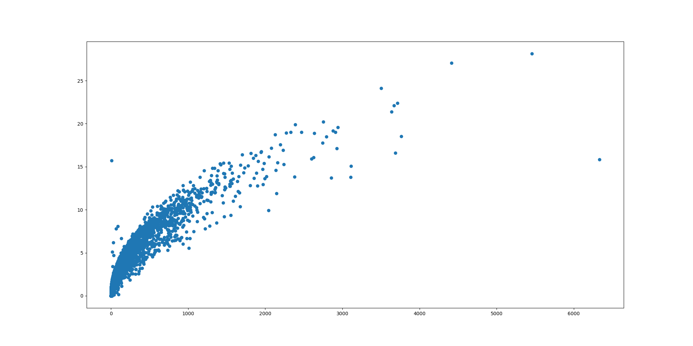

# Violet Styler

Ultra-Personalized Custom Service Implementation for `Violet-Server`

## What is Violet Styler?

`Violet Styler` is a data analyzer to provide users with personalized data.

## Features

### Burst Time

```
1946094
 0.8, 0.5, 0.9, 0.8, 1.7, 2.8, 1.9, 1.2, 1.3, 0.9, 0.7, 0.5, 1.3, 1.2, 1.1, 0.7, 0.9, 0.9, 0.8, 0.8, 0.9, 1.1, 1.5, 1.7, 1.2, 0.8, 1.3, 1.0, 0.8, 1.2, 1.3, 0.9, 0.5, 0.7, 0.9, 0.5, 0.9, 1.8, 0.1, 0.0, 0.0
1948960
 0.9, 1.2, 1.6, 1.9, 1.8, 1.6, 1.5, 2.0, 1.8, 1.4, 1.3, 1.4, 1.6, 1.4, 1.7, 1.5, 0.5, 0.6, 1.1, 0.7, 1.2, 1.0, 1.1, 0.7, 0.7, 0.7, 0.6, 0.7, 0.8, 1.2, 1.0, 0.4, 0.3, 0.5, 0.3, 1.0, 1.5, 2.4, 1.5, 1.1, 1.3, 0.8, 1.1, 1.2, 0.7, 0.9, 0.7, 0.8, 0.6, 0.8, 0.6, 0.7, 0.5, 0.5, 0.4, 0.6, 0.4, 0.5, 0.7, 1.2, 0.7, 0.9, 0.9, 0.8, 0.7, 0.8, 0.4, 0.8, 1.3, 2.4, 0.1
1947825
 2.3, 1.2, 1.4, 1.2, 0.8, 1.7, 1.9, 0.8, 1.0, 1.1, 1.2, 0.8, 0.6, 0.5, 0.8, 0.8, 0.5, 0.8, 0.5, 0.4, 0.5, 1.3, 1.0, 0.8, 1.8, 0.0
1947008
 1.8, 1.7, 1.5, 1.5, 1.1, 1.1, 0.8, 0.9, 0.7, 0.5, 1.0, 0.5, 1.2, 1.9, 1.1, 1.3, 1.3, 0.9, 0.5, 0.3, 0.2, 0.4, 1.7, 0.0
1946213
 2.2, 1.8, 1.5, 1.2, 1.2, 1.0, 0.7, 0.6, 0.9, 0.9, 1.0, 0.7, 1.0, 0.8, 0.8, 0.5, 0.5, 0.6, 0.4, 1.6, 1.9, 0.0
1945434
 3.4, 2.0, 1.9, 2.4, 2.8, 1.7, 1.2, 0.9, 0.8, 1.1, 1.6, 1.8, 1.7, 1.4, 1.2, 1.1, 1.7, 2.2, 1.0, 0.6, 1.0, 1.3, 1.1, 0.8, 0.7, 0.7, 1.2, 1.1, 0.7, 0.6, 1.1, 2.1, 1.7, 1.0, 0.9, 0.5, 0.6, 0.7, 0.6, 0.5, 0.5, 0.5, 0.4, 0.3, 0.4, 0.4, 0.4, 0.6, 0.7, 0.6, 0.7, 0.6, 0.6, 0.6, 0.4, 0.3, 0.2, 0.1, 0.7, 0.0, 0.0
1942740
 4.9, 3.9, 3.0, 1.9, 1.5, 2.6, 2.9, 1.9, 1.7, 1.3, 1.5, 1.3, 2.1, 1.5, 1.2, 1.7, 2.8, 1.3, 1.2, 1.1, 1.3, 1.2, 1.1, 1.0, 1.4, 1.7, 1.1, 1.8, 2.8, 2.4, 2.3, 2.9, 2.9, 1.1, 1.3, 2.5, 1.6, 1.4, 1.3, 2.7, 1.4, 1.0, 0.9, 1.2, 0.8, 0.7, 0.8, 0.7, 0.5, 0.4, 0.4, 0.3, 0.3, 0.3, 0.2, 0.2, 0.2, 0.1, 0.1, 0.1, 0.1, 0.2, 0.1, 0.1, 0.1, 0.1, 0.1, 0.1, 0.1, 0.1, 0.1, 0.1, 0.1, 0.1, 0.1, 0.1, 0.1, 0.1, 0.1, 0.1, 0.1, 0.1, 0.1, 0.1, 0.1, 0.1, 0.1, 0.1, 0.1, 0.6, 0.0
1945287
 2.0, 1.4, 1.4, 1.2, 1.2, 1.3, 1.0, 1.5, 0.8, 0.8, 1.2, 1.1, 1.0, 1.0, 1.4, 1.9, 1.3, 1.0, 0.7, 0.9, 0.4, 0.5, 0.7, 0.7, 0.9, 1.1, 0.7, 0.6, 0.6, 1.2, 1.1, 1.3, 1.2, 0.5, 0.6, 0.6, 0.6, 0.6, 0.5, 0.4, 0.3, 0.4, 0.5, 0.7, 0.9, 1.3, 1.4, 2.3, 1.6, 2.1, 1.3, 0.0
1944305
 1.9, 1.7, 1.9, 2.3, 3.1, 2.3, 1.7, 1.2, 0.8, 0.9, 1.0, 1.1, 1.0, 0.6, 0.8, 0.8, 0.8, 0.6, 0.6, 0.7, 0.6, 1.1, 0.6, 0.5, 0.4, 0.5, 0.7, 0.4, 0.4, 0.3, 0.7, 1.1, 0.0
1944094
 1.5, 1.1, 1.3, 1.1, 1.2, 1.2, 1.0, 0.6, 0.6, 1.5, 0.0
1948755
 2.3, 1.6, 1.5, 1.6, 1.4, 1.1, 1.2, 1.6, 1.6, 1.1, 1.1, 1.5, 1.3, 1.2, 1.6, 1.7, 1.0, 0.8, 0.8, 1.0, 0.9, 0.9, 0.5, 0.6, 0.6, 0.4, 0.4, 0.6, 1.2, 0.6, 0.4, 0.4, 0.3, 0.3, 0.4, 0.7, 1.2, 1.5, 0.0
...
```

## Personal Read Pattern Analysis

### Thumbnail Aggro Index (TAI)

### Valid Read Time per Pages (VRTP)

```
VRTP = VRT / VRP
VRT := Valid Read Time
VRP := Valid Read Page
```

### Drop Out Filter (DOF)

```
DOF(Array) = Returns an array with the normal distribution 0% to 5% and 95% to 100% are removed.
```

### MPP & V(MPP), V(MPP)'s Singularity

```
MPP = P x VT ( Page x Valid Time )
V(MPP) = VT x COUNT(P)
```

### Reproduced Valid Read-Time per Pages (RVRTP)

```
RVRTP = VAvg( V(MPP) )
```

### VRP with Concentration Weight (FVRP)

```
FVRP = Applies correction values to values between the normal distribution 0% and 20% and 80% to 100% .
```

### Noise Filter Model (NFM)

```
                   1
nfm(w) = ----------------------
         1 + e^-((w - 0.2) * 5)
```

### User Article Score (Score)

```
Score := nfm(vavg(mpp) / pages) * fvrp
```

```
...
----------------------------
1154251, 46, 63500ms, 1380.4ms, 1522.0, 46/49
50700ms, 1152.3ms, 1071.2, 44/49, 1349.9796571805266
----------------------------
1221893, 40, 59800ms, 1533.3ms, 1342.9, 39/64
45000ms, 1250.0ms, 951.2, 36/64, 1351.889235878271
----------------------------
1809473, 47, 56300ms, 1759.4ms, 1417.7, 32/71
40500ms, 1396.6ms, 885.7, 29/71, 1351.9940779711249
----------------------------
1906183, 185, 264800ms, 1463.0ms, 1750.6, 181/262
204100ms, 1179.8ms, 1050.8, 173/262, 1352.9949475513167
----------------------------
1613612, 27, 33900ms, 1412.5ms, 1573.0, 24/29
22300ms, 1013.6ms, 870.4, 22/29, 1357.5651516140024
----------------------------
1933860, 58, 76700ms, 1475.0ms, 1763.1, 52/76
53400ms, 1089.8ms, 728.2, 49/76, 1359.1061930239641
----------------------------
1962319, 25, 34700ms, 1388.0ms, 1512.7, 25/26
23100ms, 1004.3ms, 795.9, 23/26, 1359.2911665467584
----------------------------
1898387, 32, 44900ms, 1403.1ms, 1024.8, 32/33
39500ms, 1274.2ms, 743.1, 31/33, 1365.4113343788645
----------------------------
1960738, 87, 151100ms, 1820.5ms, 1702.1, 83/186
121100ms, 1552.6ms, 1369.4, 78/186, 1366.7125769557317
----------------------------
1872642, 86, 121500ms, 1396.6ms, 1311.4, 87/87
103900ms, 1236.9ms, 946.4, 84/87, 1368.3342974231996
----------------------------
1339881, 59, 82700ms, 1401.7ms, 1922.6, 59/60
59400ms, 1060.7ms, 1028.1, 56/60, 1376.3851899085778
...
```

### User Confidence Level (UCL)

### Likes and Dislikes Index (LDI)

### Article Relevance Tree

### Article Read Time per Page (ARTPP)

#### Plot (Read Count, RTPP)


#### Plot (Read Count, RTPP-Std)



#### Plot (Read Count, RTPP-Std divide by Sqrt(Read Count))


